# 图书馆管理系统 - 业务流程图

## 1. 用户注册流程

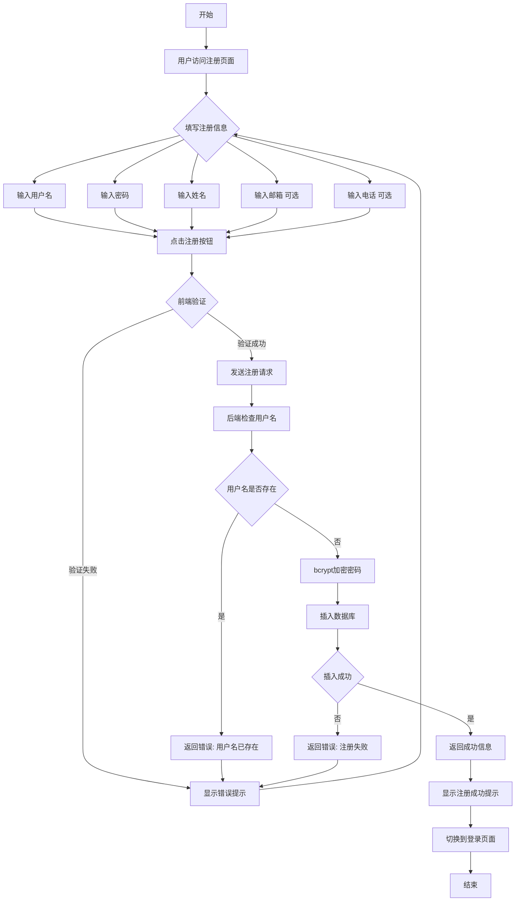

---

## 2. 用户登录流程

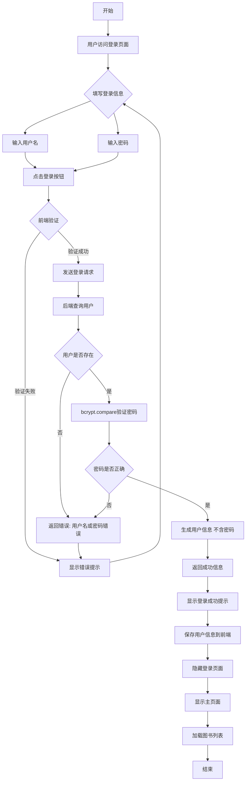

---

## 3. 图书入库流程

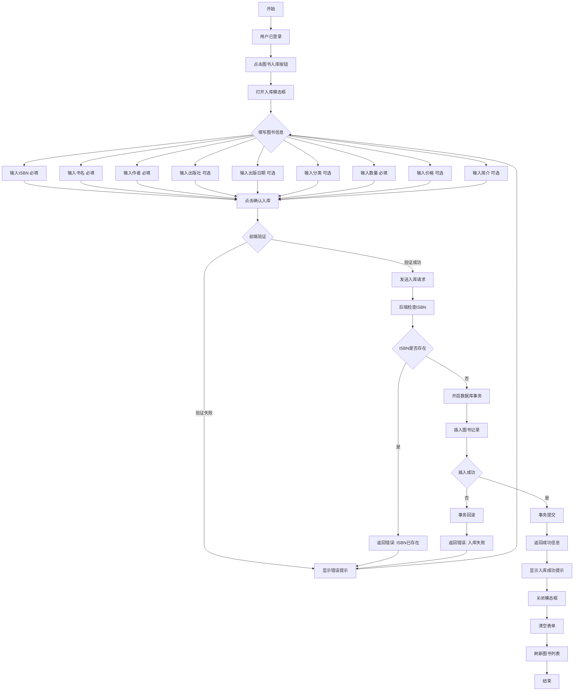

---

## 4. 图书搜索流程

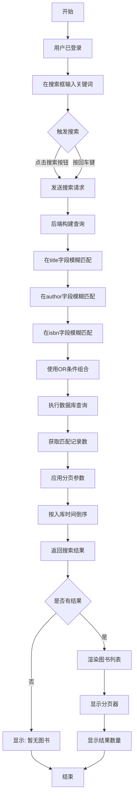

---

## 5. 图书借阅流程

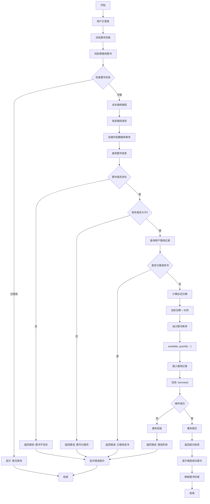

---

## 6. 图书归还流程

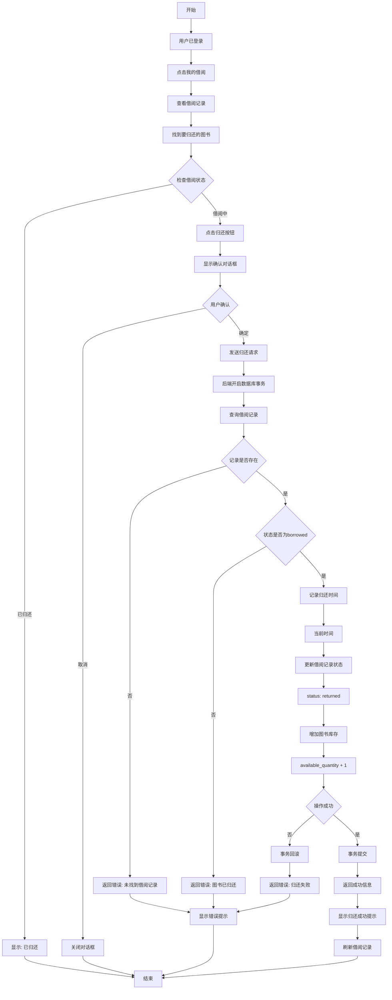

---

## 7. 借阅记录查询流程

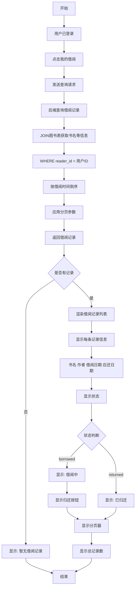

---

## 8. 借阅排行榜生成流程

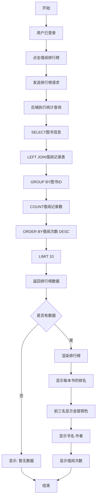

---

## 9. 系统整体业务流程

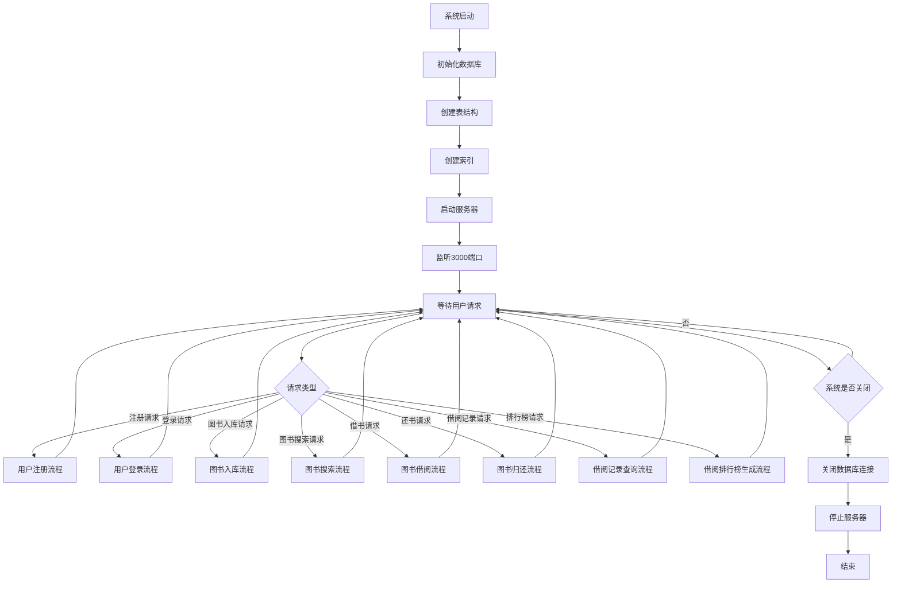

---

## 10. 数据库事务处理流程（借阅/归还）

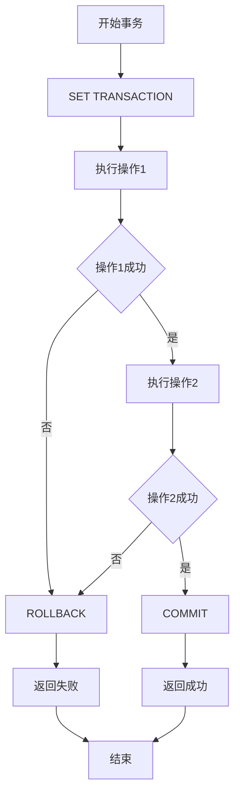

### 借阅事务示例
```
操作1: UPDATE books SET available_quantity = available_quantity - 1 WHERE id = ?
操作2: INSERT INTO borrow_records (reader_id, book_id, borrow_date, due_date, status) VALUES (?, ?, ?, ?, ?)
```

### 归还事务示例
```
操作1: UPDATE books SET available_quantity = available_quantity + 1 WHERE id = ?
操作2: UPDATE borrow_records SET return_date = ?, status = 'returned' WHERE id = ?
```

---

## 11. 数据一致性保障流程

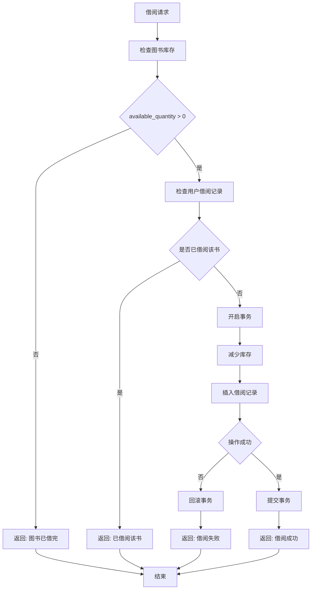

---

## 12. 错误处理流程

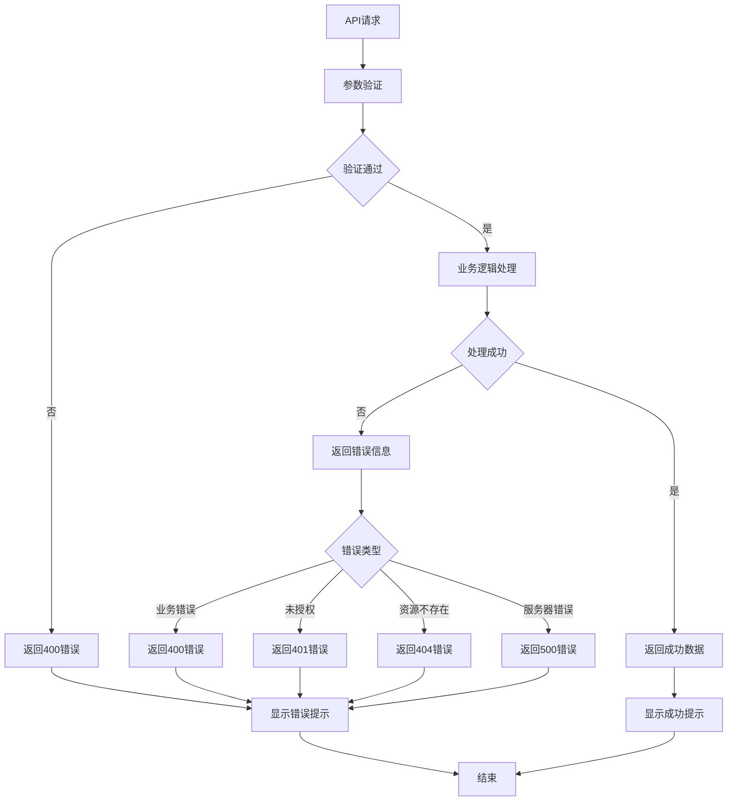

---

## 流程图说明

### 图例
- **矩形**: 表示操作或处理步骤
- **菱形**: 表示判断条件
- **圆角矩形**: 表示开始或结束
- **箭头**: 表示流程方向

### 关键流程说明

1. **事务处理**: 借阅和归还操作都使用数据库事务，确保数据一致性
2. **并发控制**: 通过事务和库存检查，防止超借和库存不一致
3. **错误处理**: 每个流程都有完善的错误处理机制
4. **数据验证**: 前后端双重验证，确保数据有效性
5. **安全性**: 密码使用bcrypt加密，SQL使用参数化查询

### 性能优化点

1. **分页查询**: 所有列表都支持分页
2. **索引优化**: 为常用查询字段创建索引
3. **批量操作**: 使用事务批量执行多个操作
4. **缓存建议**: 热门数据可以缓存（如排行榜）

---

## 使用说明

本流程图使用Mermaid语法编写，可以在以下工具中查看：

1. **GitHub**: 直接在GitHub仓库中查看
2. **VS Code**: 安装Mermaid插件预览
3. **在线工具**: 访问 https://mermaid.live/

### 在VS Code中查看
1. 安装 "Markdown Preview Mermaid Support" 插件
2. 打开本文件
3. 按 Ctrl+Shift+V 预览

### 在线查看
1. 复制流程图代码
2. 访问 https://mermaid.live/
3. 粘贴代码即可查看